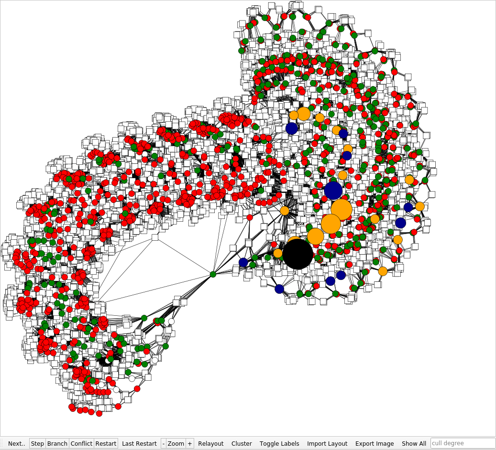

# satexplorer

This tool can be used to visualize the process of solving SAT instances.
It can layout the clause variable incidence graph and be used to step through a trace of a solution process, highlighting the variables which are touched.
The default solver is Minisat, but we a provide a header file, that hopefully makes it easy to integrate tracing into other SAT solvers using CDCL.



## Build

We tested installation on Linux (Ubuntu and Archlinux), but Mac OS and Windows might also work.

Install the dependencies:

- qt5-base (libqt5 on Ubuntu)
- OGDF with our patches (Find detailed instructions in [ogdf_installation/README.md](ogdf_installation/README.md))
- python-networkx
- python-louvain
- zlib
- bison
- flex

Remember to init and update git submodules

Inside the repository create a build folder and `cd` into it, execute `cmake ..` and `make`.

### Using your own SAT solver

[Our fork of Minisat](https://github.com/simonkrogmann/minisat) provides a headerfile which contains functions, that can be used for writing the tracefile, that is rendered in satexplorer.
Call these functions at the relevant spots in the solver and than change the solver command in the initialize function in [satviewer/Stepper.cpp](satviewer/Stepper.cpp) with your own solver.

## Related Tools

The following tools convert circuits to SAT instances for hardware verification:
- [bmc](http://www.cs.cmu.edu/~modelcheck/bmc.html) ([fork for modern compilers](https://github.com/simonkrogmann/bmc))
- [bcsat](https://github.com/scrippie/bcsat)

## Usage

Run `./satviewer-bin [sat-instance] [options]` in build folder.
The sat instance must be in cnf format.
If none is specified, a file dialog will open to select one.

Functionality:

- Step, Branch, Next Conflict, Next Restart: Skip forward and display to the next entry in the tracefile matching the clicked type.
- Last restart: Skip forward to the last restart entry in the tracefile
- Relayout: re-run the layouting algorithm
- Zoom in/out: does what it says
- Cluster: run the clustering script and apply the resulting clustering (via colors)
- Show all: resets node culling - all nodes and edges will be visible. also relayouts the graph.
- Exports the underlying `.svg` as `.png` - will be saved in ${working_directory}/data/exported_image.png
- Textbox: insert a number here to cull nodes with degree larger than the entered value.
- Draw a rectangle with the mouse (click&drag) to color all nodes in the rectangle. Rightclicking and drawing will reset the color to white.

Color coding:

When stepping through the tracefile, (variable-)nodes are assigned a color based on their state within minisat at that time.
- Red/Green: It was inferred that the variable has to be set to `false`/`true`
- Orange/Blue: Minisat branched on this Node (It tries out different 'paths') and set it to `false`/`true`
- Black: A conflict was detected in this variable. That means it was inferred that this variable has to be set to both `true` and `false` to satisfy the formula.

### Options

| Flag | Description |
| --- | --- |
| -f | force recomputation of the solution instead of reusing a previous trace file |
| -s | visualize the graph simplified by minisat instead of the original graph |
| -i | display an implication graph, i.e., only edges for clauses with two variables |


### VSCODE launch configuration

```
{
    "name": "debug",
    "type": "cppdbg",
    "request": "launch",
    "program": "${workspaceFolder}/build/satviewer-bin",
    "args": ["path/to/file.cnf"],
    "stopAtEntry": false,
    "cwd": "${workspaceFolder}/build/",
    "environment": [],
    "externalConsole": true,
    "MIMode": "gdb",
    "setupCommands": [
        {
            "description": "Enable pretty-printing for gdb",
            "text": "-enable-pretty-printing",
            "ignoreFailures": true
        }
    ]
}
```
## How satviewer works
The program takes files in `DIMACS` (`.cnf`) format. For detailed information refer to [http://people.sc.fsu.edu/~jburkardt/data/cnf/cnf.html](http://people.sc.fsu.edu/~jburkardt/data/cnf/cnf.html)
The input file is converted to the `GML` format via a python script. The `.gml` file can then be read by the [OGDF](http://amber-v7.cs.tu-dortmund.de/doku.php/start) library.

The `.cnf` file is also used to run the SAT solver [minisat](https://github.com/niklasso/minisat). This generates a tracefile (`.trace`), documenting the steps the solver took during the solving process. Additionally, minisat generates a `.solution` file containing a solution of the SAT Instance, if there is any.

### The tracefile
The tracefile encodes the steps taken by minisat in binary. The format is `char` followed by `int32`. This combination is called a `block`. For information how each step is encoded as a char refer to the `stepFromCharacter` map in `satviever/Stepper.cpp`.

For the Step Types that set a variable to `true` or `false` the sign of the integer corresponds to `true` for positive and `false` for negative. (e.g '+' and 1000 would set variable 1000 to `true`, while '+' and -1000 woould set it to `false`)

Clauses are handled a bit differently. The start of a clause is indicated by **'L'** or **'U'**. Its followed by the ID of the new clause (minisat makes sure it does not conflict with existing clauses).
The next block has to have the flag 'S', indicating the start of the variable sequence. The integer denotes the amount of variables in the clause.
The following blocks represent the variables that are part of the clause. the `char` will be 'x' and the integer contains the ID of the variable.

### Clustering
Clustering is done via a python script using the [python-louvain](https://github.com/taynaud/python-louvain) implementation of the Louvain algorithm.

### Interface and Drawing
We are using Qt5 for the GUI. The graph image is rendered as an `.svg` by the OGDF Library.

## Custom Libraries and tools

### ogdfWrapper
As the name tells, this is a wrapper around the OGDF library. It simplyfies access to OGDF's functions.
Its purpose is to hold and manage a graph instance.
It can
- read a graph from a `.gml` file
- write/render the graph to `.gml` and `.svg`
- layout the graph using different layout algorithms
- set color, shape and size of nodes
- add and remove nodes/edges
- set height of nodes, useful for rendering order

### sripts

- **cligToCNF** converts a clause-literal-incidence-graph in `.csv` format to `.cnf` format.
- **cnfToGML** converts a SAT instance in `.cnf` (DIMACS) format to `.gml`
- **louvain_clustering** calculates a clustering on a graph in `.gml` format using the louvain community detection algorithm. Output format is a textfile with [node id] [cluster number] in each line.
